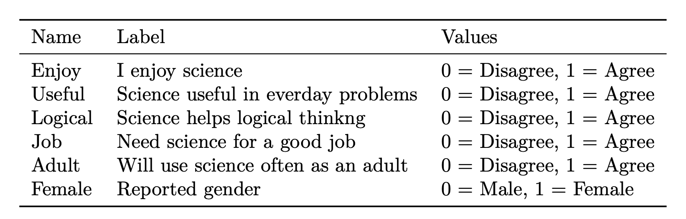

```{r setup, include=FALSE}
knitr::opts_chunk$set(echo = TRUE, warning = FALSE, message = FALSE) 
```

> Mixture Modeling for Discipline Based Education Researchers (MM4DBER) is an NSF funded training grant to support STEM Education scholars in integrating mixture modeling into their research.

# --------------------------------------------------------------------------------------

### Getting familiar with the RStudio interface

Step 1: Open RStudio

Step 2: Create a new R-project

Step 3: Create an R-markdown document

# --------------------------------------------------------------------------------------

### Step 4: Load packages

Load and install packages (if needed)
```{r}
library(psych)     # describe()
library(here)      # helps with specifying file paths
library(gt)        # create tables
library(tidyverse) # collection of R packages designed for data science

#install.packages("palmerpenguins")
library(palmerpenguins) # data for plot example
```

# --------------------------------------------------------------------------------------

### Step 5: Make a quick plot (To show off what R can do!)

Look first
```{r}
head(penguins)
```

Plot!
```{r}

ggplot(data = penguins, aes(x = flipper_length_mm, fill = species)) +
  geom_histogram(position = "identity") 

# Extras to make plot pretty
# 1.  alpha = 0.5, 
# 2.  scale_fill_manual(values = c("darkorange","purple","cyan4"))
# 3.  labs(x = "Flipper length (mm)", y = "Frequency")
# 4.  theme_minimal()

```

# --------------------------------------------------------------------------------------

## Explore data

# --------------------------------------------------------------------------------------

### Step 6: Read in data

Table : *LSAY Variable Descriptions*



Read data into R: 
```{r}
data <- read_csv(here("data", "lsay_sci_data.csv")) 
```

View data in R
```{r}
# 1. click on the data in your Global Environment (upper right pane) 


# 2. summary() gives basic summary statistics & shows number of NA values
summary(data) 

# 3. names() provides a list of column names. Very useful if you don't have them memorized!
names(data)

# 4. head() prints the top 5 rows of the dataframe
head(data)


```

### Step 7: Manipulating `data.frames` (select columns and filter rows)

Look at a functions documentation: What does the `select()` function do?
```{r, eval=FALSE}

?select()
```

**Three useful keyboard shortcuts**:
1. Create a new code block: `Cmd + Option + I` (windows; `Ctrl + Alt + I`)
2. Inside a code block (`<-`): `option + dash (-)` 
3. Inside a code block (`%>%`): `Ctrl + Shift + M`

Selecting variables or columns of a `data.frame`
```{r}
# Select columns one at a time
data_attitudes <- data %>% 
  select(Enjoy, Useful, Logical)

# Select columns left to right
data_attitudes <- data %>% 
  select(Enjoy:Adult)

# Remove columns
data_attitudes <- data %>% 
  select(-Female)
```


What if we want to look at a subset of the data?

- For example, what if we want to subset the data for female science attitudes? (`Female`)
- We can use `tidyverse::filter()` to subset the data using certain criteria.

```{r}
# Filter rows
data_female <- data %>% 
  filter(Female == 1) 

# You can use any operator to filter: >, <, ==, >=, etc.

data_female %>% nrow()
```


### Step 8: Descriptive Statistics

Let's look at descriptive statistics for each of the science attitude variables.
```{r}
data_attitudes %>% 
  summary()
```

Alternatively, we can use the `psych::describe()` function to give more information:
```{r}
data_attitudes %>% 
  describe()
```

Since we have binary data, it would be helpful to look at variable proportions:
```{r}
data %>% 
  drop_na() %>% 
  pivot_longer(Enjoy:Adult, names_to = "variable") %>% 
  group_by(variable) %>% 
  summarise(prop = sum(value)/n(),
            n = n()) %>%
  arrange(desc(prop))
```


# --------------------------------------------------------------------------------------

## References

Hallquist, M. N., & Wiley, J. F. (2018). MplusAutomation: An R Package for Facilitating Large-Scale Latent Variable Analyses in Mplus. Structural equation modeling: a multidisciplinary journal, 25(4), 621-638.

Miller, J. D., Hoffer, T., Suchner, R., Brown, K., & Nelson, C. (1992). LSAY codebook. Northern Illinois University.

Muthén, L.K. and Muthén, B.O. (1998-2017). Mplus User's Guide. Eighth Edition. Los Angeles, CA: Muthén & Muthén

R Core Team (2017). R: A language and environment for statistical computing. R Foundation for Statistical Computing, Vienna, Austria. URL http://www.R-project.org/

Wickham et al., (2019). Welcome to the tidyverse. Journal of Open Source Software, 4(43), 1686, https://doi.org/10.21105/joss.01686

# --------------------------------------------------------------------------------------

